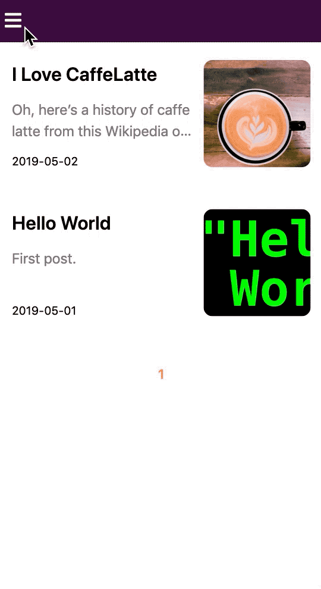

# gatsby-starter-nagui




## :computer: Demo

-   <http://demo.nagui.me/>

## :rocket: Quick Start

### 1. Install gatsby-cli

```sh
$ npm install -g gatsby-cli
```

### 2. Create Project

```sh
$ gatsby new my-blog-starter https://github.com/kimnagui/gatsby-starter-nagui
```

### 3. Start Project

```sh
$ cd my-blog-starter
$ gatsbyjs develop
# open http://localhost:8000
```

## :star: Features

-   Tags & Categorys.
-   Pagination.
-   Styled-Components.
-   Atomic Design Components.
-   Mobile-First CSS.
-   Syntax highlighting in code blocks using PrismJS(Dracula).
-   Google Analytics.
-   Deploy AWS S3.
-   Emoji.

## :open_file_folder: Structure

```
src
 ├── components
 │     ├── atoms
 │     ├── molecules
 │     ├── organisms
 │     ├── templates
 │     └── seo.js
 ├── pages
 │     └── 404.js
 ├── utils
 │     └──typography.js
 └── html.js
```

## :wrench: Config Files

```
config.js
gatsby-browser.js
gatsby-config.js
gatsby-node.js
```

## :dart: Todo

-   Comment
-   Search
-   Bio in post
-   Design Tag & Category Index
-   Dark Mode
